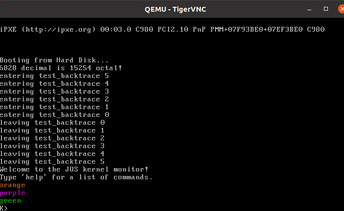

### Exercise 2
`cli`指令全称Clear Interrupt Flag，把 EFLAGS 寄存器（实模式是 FLAGS）里的 IF 位 (Interrupt Flag) 清零。防止被打断。\
`cld`指令重置DF位\
这段汇编代码是在打开 A20 地址线
```x86asm
in      $0x92,%al
or      $0x2,%al
out     %al,$0x92
```
这行代码是在加载Interrupt Descriptor Table Register\
即加载 IDT，告诉 CPU 中断描述符表的位置。
```x86asm
lidtw  %cs:0x6ab8
```
```x86asm
[f000:d17d]    0xfd17d: mov    %cr0,%eax
0x0000d17d in ?? ()
(gdb) 
[f000:d180]    0xfd180: or     $0x1,%eax
0x0000d180 in ?? ()
(gdb) 
[f000:d184]    0xfd184: mov    %eax,%cr0
0x0000d184 in ?? ()
```
这段更新了`%cr0`，切换到保护模式\
接下来长跳转到0xfd18f, 切换为内核代码段(`$0x8`), 更新CS 
```x86asm
[f000:d187]    0xfd187:
    ljmpl  $0x8,$0xfd18f
```
之后重置寄存器，跳转至内核代码段

### Exercise 3
Compare the original boot loader source code with both the disassembly in `obj/boot/boot.asm` and GDB: 源代码中不含有物理地址，boot.asm中保留了物理地址和函数命名，GDB中丢失了函数命名信息。\
```x86asm
	for (; ph < eph; ph++)
    7d66:	39 f3                	cmp    %esi,%ebx
    7d68:	73 17                	jae    7d81 <bootmain+0x5c>
		readseg(ph->p_pa, ph->p_memsz, ph->p_offset);
    7d6a:	50                   	push   %eax
	for (; ph < eph; ph++)
    7d6b:	83 c3 20             	add    $0x20,%ebx
		readseg(ph->p_pa, ph->p_memsz, ph->p_offset);
    7d6e:	ff 73 e4             	pushl  -0x1c(%ebx)
    7d71:	ff 73 f4             	pushl  -0xc(%ebx)
    7d74:	ff 73 ec             	pushl  -0x14(%ebx)
    7d77:	e8 66 ff ff ff       	call   7ce2 <readseg>
	for (; ph < eph; ph++)
    7d7c:	83 c4 10             	add    $0x10,%esp
    7d7f:	eb e5                	jmp    7d66 <bootmain+0x41>
	((void (*)(void)) (ELFHDR->e_entry))();
    7d81:	ff 15 18 00 01 00    	call   *0x10018
```
`for` 循环的入口是`0x7d66`, 出口是`0x7d81`. `0x10018`指向的地址处的函数会被执行.  
运行`p/x *0x10018`, 输出`$1 = 0x10000c`, 于是`b *0x10000c` 打下断点.
#### Questions
- At what point does the processor start executing 32-bit code? What exactly causes the switch from 16- to 32-bit mode?


```x86asm
  movl    %cr0, %eax
  orl     $CR0_PE_ON, %eax
  movl    %eax, %cr0
```
> 这几步指令使处理器开始执行32位代码  
```x86asm
00007c32 <protcseg>:
    .code32                     # Assemble for 32-bit mode
```
> 在.code32这里完成了代码上的切换，使得汇编代码转为32位模式
- What is the last instruction of the boot loader executed, and what is the first instruction of the kernel it just loaded?  
`7d81:	ff 15 18 00 01 00    	call   *0x10018`是最后执行的代码  
内核执行第一条代码是`0x10000c:    movw   $0x1234,0x472`  
- Where is the first instruction of the kernel?  
physical address `0x10000c` 
- How does the boot loader decide how many sectors it must read in order to fetch the entire kernel from disk? Where does it find this information?  
通过读取ELF的Program Header, 获得其中文件的大小, 从而根据此计算出应读的扇区数.

### Exercise 5
修改链接地址为0x7c10会出现这样的情况  
`Program received signal SIGTRAP, Trace/breakpoint trap.
[   0:7c2d] => 0x7c2d:  ljmp   $0x8,$0x7c42`
跳转的位置0x7c42和汇编代码一致，但问题是汇编代码中
`00007c10 <start>:`这一行说明需要的加载地址应该是0x7c10.  
由于BIOS将boot loader加载到了0x7c00, 导致ljmp的地址和实际地址不符, 导致跳跃到的是错误区域

### Exercise 6
> 当内核未被加载进内存时
```shell
(gdb) x/4x 0x100000
0x100000:       0x00000000      0x00000000      0x00000000      0x00000000
(gdb) 
0x100010:       0x00000000      0x00000000      0x00000000      0x00000000
```
> 当 boot loader 跳到内核 时，它已经把 **内核镜像** 从磁盘加载到 `0x00100000`，所以这时候那里存放的就是 内核的机器代码
```shell
(gdb) x/4x 0x100000
0x100000:       0x1badb002      0x00000000      0xe4524ffe      0x7205c766
(gdb) 
0x100010:       0x34000004      0x2000b812      0x220f0011      0xc0200fd8
```
### Exercise 7
> "CR3（页目录基址寄存器）：保存当前使用的页目录的物理地址。" 明白这一点后，只需要把PDT的物理地址load进CR3，再配合自己手打的页表即可实现~~几乎裸奔的~~分页模式  
> 实际上CR3存储的基址是`$0x112000`
> `orl	$(CR0_PE|CR0_PG|CR0_WP), %eax` 这一步在CR0取出的值上添加保护模式位，分页位和写保护位. 之后在`mov    %eax,%cr0`指令中写回，分页模式正式开启
- What is the first instruction after the new mapping is established that would fail to work properly if the mapping weren't in place?
> `jmp	*%eax` 这一步后指令执行就会出错

### Exercise  8
Replace the original code
```c
		case 'o':
			putch('X', putdat);
			putch('X', putdat);
			putch('X', putdat);
```
with
```c
			num = getuint(&ap, lflag);
			base = 8;
			goto number;
```
#### Questions
- Explain the interface between printf.c and console.c. Specifically, what function does console.c export? How is this function used by printf.c?
> `console.c` exports function `void cputchar(char)`. `void cputchar(char)` is wrapped to `putch`, which is sent to vprintfmt as the first argument.
- Explain the following from console.c:
```c
1      if (crt_pos >= CRT_SIZE) {
2              int i;
3              memmove(crt_buf, crt_buf + CRT_COLS, (CRT_SIZE - CRT_COLS) * sizeof(uint16_t));
4              for (i = CRT_SIZE - CRT_COLS; i < CRT_SIZE; i++)
5                      crt_buf[i] = 0x0700 | ' ';
6              crt_pos -= CRT_COLS;
7      }
```
> 实行滚屏操作，将第二行到最后一行整体向上移动一行，将新一行的字符设置为白色空格
- Trace the execution of the following code step-by-step:  
`int x = 1, y = 3, z = 4;`  
`cprintf("x %d, y %x, z %d\n", x, y, z);`
> In the call to cprintf(), to what does fmt point? To what does ap point?  
首先是fmt指向一个字符串`"x %d, y %x, z %d\n"`, ap会指向参数`x`

> List (in order of execution) each call to cons_putc, va_arg, and vcprintf. For cons_putc, list its argument as well. For va_arg, list what ap points to before and after the call. For vcprintf list the values of its two arguments.
在`vprintfmt`中, 先对`x`和` `执行了putch, 在处理`%d`的时候调用了一次`getint`, 其中调用了`va_arg(*ap, int)`. 接着调用四次`putch`输`%x`的时候调用了一次`getuint`, 其中调用了`va_arg(*ap, unsigned int)`. 接着调用四次`putch`输出`, z `, 在处理`%d`的时候调用了一次`getint`, 其中调用了`va_arg(*ap, int)`. 最后调用两次`putch`输出`\n`. 三个数字的输出各调用了一次`putch`
而每个`putch`函数都会调用一次`cons_putc`函数, 参数即为`x`,` `,`1`,`,`,` `,`y`,` `,`3`,`,`,` `,`z`,` `,`4`,`,`,` `,`\`,`n`. 共17次. `va_arg`共调用了三次, 各次调用之后ap分别指向`y`, `z`和参数表末尾. `vcprintf`函数的两个参数分别为`fmt = "x %d, y %x, z %d\n"`, `ap = &x`
- Run the following code.
```c
    unsigned int i = 0x00646c72;
    cprintf("H%x Wo%s", 57616, &i);
```
运行结果为`He110 World`. 具体来说, 57616的16进制表示是`0xe110`, 而对`i`来说, 其在内存的存储方式如下: `0x72 0x6c 0x64 0x00`, 这是由于x86架构采用小端法, 也即从小的数位开始存储. 而将`0x72 0x6c 0x64 0x00`按字符串的方式理解, 就得到了`rld\0`
- In the following code, what is going to be printed after 'y='? (note: the answer is not a specific value.) Why does this happen?
`cprintf("x=%d y=%d", 3);`
> 因为没有第三个参数, ap会指向栈上的一个garbage value, 导致运行的结果不确定. 
- Let's say that GCC changed its calling convention so that it pushed arguments on the stack in declaration order, so that the last argument is pushed last. How would you have to change cprintf or its interface so that it would still be possible to pass it a variable number of arguments?
在`cprintf`改为
```c
int
cprintf(const char *fmt, ...)
{
	va_list ap;
	int cnt;

  ap = (va_list*)&fmt
	cnt = vcprintf(fmt, ap);

	return cnt;
}
```
并修改`vprintfmt`中用到的`va_arg(ap, type)`方法, 使得效果为: `ap = ap - sizeof(type)`. 并且返回`*((type*)ap)`  
### Challenge

具体流程: 首先在`inc/color.c`中创建一个全局变量`color`, 并在`console.c`, `printfmt.c`中引用`inc/color.c`文件. 利用`%m`格式化读取一个`int`来设置颜色. 
在`console.c`中做如下修改:
```c
static void
cga_putc(int c)
{
	// if no attribute given, then use black on white
	if (!color) color = 0x0700;
	if (!(c & ~0xFF))
		c |= color; // 利用全局颜色color来设置c

	switch (c & 0xff) {
  ...

	// What is the purpose of this?
	if (crt_pos >= CRT_SIZE) {
		int i;

		memmove(crt_buf, crt_buf + CRT_COLS, (CRT_SIZE - CRT_COLS) * sizeof(uint16_t));
		for (i = CRT_SIZE - CRT_COLS; i < CRT_SIZE; i++)
			crt_buf[i] = 0x0700 | ' ';
		crt_pos -= CRT_COLS;
	}

  ...

  }
}
```
在`printfmt.c`中作如下修改:
```c
void
vprintfmt(void (*putch)(int, void*), void *putdat, const char *fmt, va_list ap)
{
  ...
	while (1) {
		while ((ch = *(unsigned char *) fmt++) != '%') {
			if (ch == '\0'){
				color = 0x0700; // 输出完一次字符串重置颜色	
				return;
			}
			putch(ch, putdat);
		}
    ...
		switch (ch = *(unsigned char *) fmt++) {
    ...
		case 'm': // change the color
			num = getint(&ap, lflag);
			color = num;
			break;
    ...
		}
	}
}
```
为了能够显示颜色, 需要qemu打开VGA窗口, 而不是串口模式. 具体做法是: 将`GNUmakefile`中
```makefile
QEMUOPTS = -drive file=$(OBJDIR)/kern/kernel.img,index=0,media=disk,format=raw -serial mon:stdio -gdb tcp::$(GDBPORT)
QEMUOPTS += $(shell if $(QEMU) -nographic -help | grep -q '^-D '; then echo '-D qemu.log'; fi)
```
删去`-serial mon:stdio` and `-nographic`, 改成
```makefile
QEMUOPTS = -drive file=$(OBJDIR)/kern/kernel.img,index=0,media=disk,format=raw -gdb tcp::$(GDBPORT)
QEMUOPTS += $(shell if $(QEMU) -help | grep -q '^-D '; then echo '-D qemu.log'; fi)
```
并采用VNCViewer查看 
同时在`monitor.c`中如此修改: 
```c
	cprintf("Welcome to the JOS kernel monitor!\n");
	cprintf("Type 'help' for a list of commands.\n");
	cprintf("%m%s\n%m%s\n%m%s\n", 
    	0x0600, "orange", 
    	0x0500, "purple", 
    	0x0200, "green");
```
即可看到颜色效果

### Exercise 9
在`kern/entry.S`的末尾, 可以找到这么一段代码
```x86asm
###################################################################
# boot stack
###################################################################
	.p2align	PGSHIFT		# force page alignment
	.globl		bootstack
bootstack:
	.space		KSTKSIZE
	.globl		bootstacktop   
bootstacktop:
```
它在`bootstack`区域分配了`KSTKSIZE=(8*PAGESIZE)`也就是32KB的空间, 接着声明了一个全局变量`bootstacktop`, 指向`bootstack`的顶部.  
具体来说, `obj/kern/kernel.asm`记录了具体的地址:
```x86asm
	movl	$(bootstacktop),%esp
f0100034:	bc 00 10 11 f0       	mov    $0xf0111000,%esp
```
`bootstacktop`被分配为`0xf0111000`, 这就是栈顶的位置, 初始`%esp`也位于栈顶, 在调用函数中逐渐向下增长. 
`readelf -S obj/kern/kernel `即可发现, 内核将`stack`分配在了`.data`区域

### Exercise 10
- How many 32-bit words does each recursive nesting level of test_backtrace push on the stack, and what are those words?
> 每次会压入8个32-bit words. 第一个是%esi, 第二个是%ebx, 第三个是%eax, 第四个第五个第六个是为了call之前的对齐. 第七个是call指令的返回地址, 第八个是%ebp
以`test_backtrace`的第一次到第二次调用为例
```
高地址 ↑
+-----------------+  
|      %ebp       |  前一次函数调用的栈帧位置
+-----------------+  <-- 0xf0110fd8
|      %esi       |  
+-----------------+  <-- 0xf0110fd4  
|      %ebx       |   
+-----------------+  <-- 0xf0110fd0 
|                 |  
+-----------------+   
|                 |   
+-----------------+   
|                 |    
+-----------------+  <-- 0xf0110fc4   (满足对齐需要)
|      %eax       |    
+-----------------+  <-- 0xf0110fc0   
|   ret address   |    
+-----------------+  <-- 0xf0110fbc
|      %ebp       |  第一次test_backtrace调用中%ebp的值, 应为0xf0110fd8
+-----------------+  <-- 0xf0110fb8
低地址 ↓  
```

### Exercise 11
```c
int
mon_backtrace(int argc, char **argv, struct Trapframe *tf)
{
	uint32_t *ebp;
	cprintf("Stack backtrace:\n");
	if (tf) {
		// 如果是由trap调用，也只能从 read_ebp() 开始处理, 因为我们还没写异常处理 :(
		ebp = (uint32_t*)read_ebp();
	}
	else {
		// 否则从当前栈帧开始
		ebp = (uint32_t*)read_ebp();
	}
	while (ebp!=0) {
		uint32_t eip = ebp[1]; // 获得 return address
		cprintf("  ebp %x  eip %x  args", ebp, eip);
		uint32_t *lebp = (uint32_t*)(*ebp);
		for (int i = 0; i < 5; i++) {
			cprintf(" %08x", ebp[2 + i]);
		}
		cprintf("\n");
		ebp = lebp;
	}
	return 0;
}
```
按上述修改代码之后, 输出结果正常.
```bash
running JOS: (1.3s) 
  printf: OK 
  backtrace count: OK 
  backtrace arguments: OK 
  backtrace symbols: FAIL 
    AssertionError: got:
      
    expected:
      test_backtrace
      test_backtrace
      test_backtrace
      test_backtrace
      test_backtrace
      test_backtrace
      i386_init
    
  backtrace lines: FAIL 
    AssertionError: No line numbers
    
Score: 40/50
make: *** [GNUmakefile:202：grade] 错误 1
```
### Exercise 12
在`kdebug.c`中添加以下代码, 计算出`eip`对应的源码信息, 如果未找到则`return -1`
```c
	stab_binsearch(stabs, &lline, &rline, N_SLINE, addr);
	if (lline <= rline) {
		/*	示例参考
			n_strx  = 0
			n_type  = N_SLINE
			n_other = 0
			n_desc  = 304         // 源码第304行
			n_value = 0x0000000d  // 距离函数起始指令地址
		*/
		info->eip_line = stabs[lline].n_desc;
	}
	else return -1;
```
- `kern/monitor.c`   

最终`mon_backtrace`函数修改如下, 并同时在commands中添加了backtrace命令  
```c 
static struct Command commands[] = {
	{ "help", "Display this list of commands", mon_help },
	{ "kerninfo", "Display information about the kernel", mon_kerninfo },
	{ "backtrace", "Backtrace the stack frame Now", mon_backtrace },
}; 

...

int
mon_backtrace(int argc, char **argv, struct Trapframe *tf)
{
	uint32_t *ebp;
	// Your code here.
	cprintf("Stack backtrace:\n");
	if (tf) {
		// 如果是由trap调用，也只能从 read_ebp() 开始处理, 因为我们还没写异常处理 :(
		ebp = (uint32_t*)read_ebp();
	}
	else {
		// 否则从当前栈帧开始
		ebp = (uint32_t*)read_ebp();
	}
	while (ebp!=0) {
		uint32_t eip = ebp[1]; // 获得 return address
		cprintf("  ebp %x  eip %x  args", ebp, eip);
		uint32_t *lebp = (uint32_t*)(*ebp);
		for (int i = 0; i < 5; i++) {
			cprintf(" %08x", ebp[2 + i]);
		}
		cprintf("\n");
		// 查询eip的debuginfo
		struct Eipdebuginfo info;
		if (debuginfo_eip((uintptr_t)eip, &info) < 0) {
			// 部分信息读取失败, 直接打回去
			cprintf("info at %p is incomplete.\n", eip);
			return -1;
		}
		cprintf("         %s:%d: %.*s+%u\n", 
			info.eip_file, 
			info.eip_line, 
			info.eip_fn_namelen, // restrict print length
			info.eip_fn_name, 
			eip - info.eip_fn_addr);
		ebp = lebp;
	}
	return 0;
}
```
This Completes the lab.